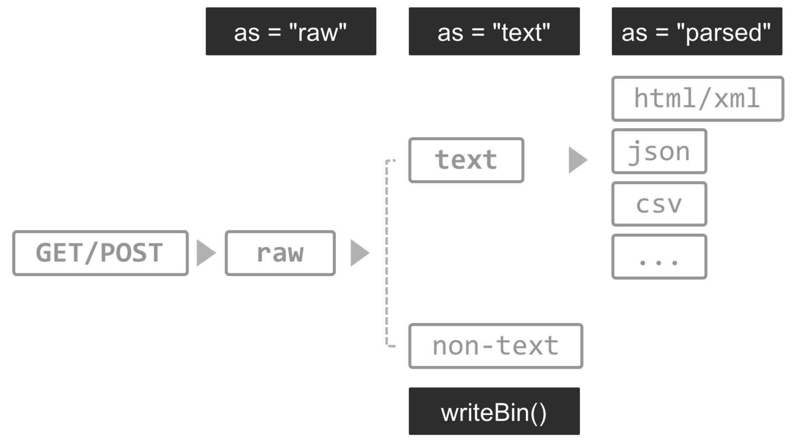

R Crawler 2
========================================================
author: Miao Chien
date: 10/19
autosize: true
transition: concave
css: custom.css
font-import: http://fonts.googleapis.com/css?family=Proza+Libre
font-family: 'Proza Libre'


使用 RStudio 與下載示範檔案
========================================================

<div class="midcenter" style="margin-left:-500px; margin-top:-300px;">
</img>
</div>

使用 RStudio 與下載示範檔案
========================================================

進入這個專案的 [github](https://github.com/MiaoChien/R-Crawler)

Clone or download > Download ZIP


使用 RStudio 與下載示範檔案
========================================================

Step1. 將 ZIP 檔解壓縮至指定工作路徑

Step2. 開啟 RStudio File > New Project...


使用 RStudio 與下載示範檔案
========================================================

</br>
</br>
Step3. 選擇 Existing Directory


***
</br>
</br>
Step4. 讀入指定的工作路徑 


所需套件
========================================================
 Pipeline Coding
- magrittr 

Crawler’s toolkits in R
- rvest: a web scraper based on httr and xml2
- httr: toolkit of HTTP methods in R
- XML : XML parser
- xml2: xml parser based on libxml2

Data manipulation
- stringr: string manipulaiton
- data.table: extension of data.frame, a powerful ETL tool in R


安裝所需套件
========================================================
程式碼在 `install_packages.R`


```r
pkg_list <- c("magrittr", "httr", "rvest", "stringr", "data.table","jsonlite", "RSQLite", "devtools")

pkg_new <- pkg_list[!(pkg_list %in% installed.packages()[,"Package"])]

if(length(pkg_new)) install.packages(pkg_new)

if("xmlview" %in% pkg_new) {devtools::install_github("hrbrmstr/xmlview")}

if("data.table" %in% pkg_new) {
    install.packages("data.table", type = "source",
                     repos = "https://Rdatatable.github.io/data.table")
} else if (packageDescription("data.table")$Version < "1.9.7") {
    install.packages("data.table", type = "source", 
                     repos = "https://Rdatatable.github.io/data.table")
}
rm(pkg_new, pkg_list)
```

好用套件介紹：magrittr
=========================================================
[magrittr package document](https://cran.r-project.org/web/packages/magrittr/magrittr.pdf)

<center>

</center>


好用套件介紹：magrittr
=========================================================


- 把左手邊的參數用 **pipeline** 「 %>% 」傳送到右手邊的函式中

- RStudio 輸入快捷鍵：
    + Windows & Linux：<kbd  class="light">Ctrl</kbd> + <kbd  class="light">Shift</kbd> + <kbd  class="light">M</kbd>
    
    + Mac：<kbd  class="light">⌘</kbd>+ <kbd  class="light">⇧</kbd> + <kbd class="light"> M</kbd>

- Use the dot  **.**   as placeholder in a expression.

    + x %>% f is equivalent to f(x)

    + x %>% f(y) is equivalent to f(x, y)

    + x %>% f %>% g %>% h is equivalent to h(g(f(x)))

    + x %>% f(y, .) is equivalent to f(y, x)

    + x %>% f(y, z = .) is equivalent to f(y, z = x)
    
    
好用套件介紹：magrittr
=========================================================

舉例：


```r
a = 1:3
df = data.frame(a, b=a^2)
rownames(df) = LETTERS[1:3]
vals = lm(b ~ a, data = df)
```

pipe chain 版本


```r
library(magrittr)
vals = 1:3 %>% data.frame(a = ., b = .^2) %>%
  set_rownames(LETTERS[1:3]) %>% lm(b ~ a, data = .)
```


好用套件介紹：data.table
==================================================================

[data.table package document](https://cran.r-project.org/web/packages/data.table/data.table.pdf)

<center>

</center>

- 取代內建 data.frame 的好工具

- 運算效率高、節省記憶體

- 資料選取方便


好用套件介紹：data.table
==================================================================
建立 data.table

```r
library(data.table)
DT = data.table(mtcars)
DT %<>% data.table(name = rownames(mtcars), .)
DT 
```

```
                   name  mpg cyl  disp  hp drat    wt  qsec vs am gear
 1:           Mazda RX4 21.0   6 160.0 110 3.90 2.620 16.46  0  1    4
 2:       Mazda RX4 Wag 21.0   6 160.0 110 3.90 2.875 17.02  0  1    4
 3:          Datsun 710 22.8   4 108.0  93 3.85 2.320 18.61  1  1    4
 4:      Hornet 4 Drive 21.4   6 258.0 110 3.08 3.215 19.44  1  0    3
 5:   Hornet Sportabout 18.7   8 360.0 175 3.15 3.440 17.02  0  0    3
 6:             Valiant 18.1   6 225.0 105 2.76 3.460 20.22  1  0    3
 7:          Duster 360 14.3   8 360.0 245 3.21 3.570 15.84  0  0    3
 8:           Merc 240D 24.4   4 146.7  62 3.69 3.190 20.00  1  0    4
 9:            Merc 230 22.8   4 140.8  95 3.92 3.150 22.90  1  0    4
10:            Merc 280 19.2   6 167.6 123 3.92 3.440 18.30  1  0    4
11:           Merc 280C 17.8   6 167.6 123 3.92 3.440 18.90  1  0    4
12:          Merc 450SE 16.4   8 275.8 180 3.07 4.070 17.40  0  0    3
13:          Merc 450SL 17.3   8 275.8 180 3.07 3.730 17.60  0  0    3
14:         Merc 450SLC 15.2   8 275.8 180 3.07 3.780 18.00  0  0    3
15:  Cadillac Fleetwood 10.4   8 472.0 205 2.93 5.250 17.98  0  0    3
16: Lincoln Continental 10.4   8 460.0 215 3.00 5.424 17.82  0  0    3
17:   Chrysler Imperial 14.7   8 440.0 230 3.23 5.345 17.42  0  0    3
18:            Fiat 128 32.4   4  78.7  66 4.08 2.200 19.47  1  1    4
19:         Honda Civic 30.4   4  75.7  52 4.93 1.615 18.52  1  1    4
20:      Toyota Corolla 33.9   4  71.1  65 4.22 1.835 19.90  1  1    4
21:       Toyota Corona 21.5   4 120.1  97 3.70 2.465 20.01  1  0    3
22:    Dodge Challenger 15.5   8 318.0 150 2.76 3.520 16.87  0  0    3
23:         AMC Javelin 15.2   8 304.0 150 3.15 3.435 17.30  0  0    3
24:          Camaro Z28 13.3   8 350.0 245 3.73 3.840 15.41  0  0    3
25:    Pontiac Firebird 19.2   8 400.0 175 3.08 3.845 17.05  0  0    3
26:           Fiat X1-9 27.3   4  79.0  66 4.08 1.935 18.90  1  1    4
27:       Porsche 914-2 26.0   4 120.3  91 4.43 2.140 16.70  0  1    5
28:        Lotus Europa 30.4   4  95.1 113 3.77 1.513 16.90  1  1    5
29:      Ford Pantera L 15.8   8 351.0 264 4.22 3.170 14.50  0  1    5
30:        Ferrari Dino 19.7   6 145.0 175 3.62 2.770 15.50  0  1    5
31:       Maserati Bora 15.0   8 301.0 335 3.54 3.570 14.60  0  1    5
32:          Volvo 142E 21.4   4 121.0 109 4.11 2.780 18.60  1  1    4
                   name  mpg cyl  disp  hp drat    wt  qsec vs am gear
    carb
 1:    4
 2:    4
 3:    1
 4:    1
 5:    2
 6:    1
 7:    4
 8:    2
 9:    2
10:    4
11:    4
12:    3
13:    3
14:    3
15:    4
16:    4
17:    4
18:    1
19:    2
20:    1
21:    1
22:    2
23:    2
24:    4
25:    2
26:    1
27:    2
28:    2
29:    4
30:    6
31:    8
32:    2
    carb
```

好用套件介紹：data.table
==================================================================
篩選 data.table

```r
DT[cyl == 8] %>% head
```

```
                 name  mpg cyl  disp  hp drat   wt  qsec vs am gear carb
1:  Hornet Sportabout 18.7   8 360.0 175 3.15 3.44 17.02  0  0    3    2
2:         Duster 360 14.3   8 360.0 245 3.21 3.57 15.84  0  0    3    4
3:         Merc 450SE 16.4   8 275.8 180 3.07 4.07 17.40  0  0    3    3
4:         Merc 450SL 17.3   8 275.8 180 3.07 3.73 17.60  0  0    3    3
5:        Merc 450SLC 15.2   8 275.8 180 3.07 3.78 18.00  0  0    3    3
6: Cadillac Fleetwood 10.4   8 472.0 205 2.93 5.25 17.98  0  0    3    4
```

好用套件介紹：data.table
==================================================================

...


再看一次爬蟲流程
==================================================================
type: pinky

<div class="midcenter" style="margin-left:-500px; margin-top:-300px;">
</img>
</div>


再看一次爬蟲流程
==================================================================
type: pinky

Step1. **Data**：找出資料藏在哪個 request 裡

- 找到資料頁，想像資料要長什麼樣子，設想產出的資料格式(schema)
- 觀察網頁內容，找到資料所在的 request/response，再一層層往上解析，套上判斷式及迴圈， 完成爬蟲的自動化
  
Step2. **Connector**：拿取資料

- 發送 HTTP request 
- 取得 HTTP response
    
Step3. **Parser**：解析所得資料

- 解析結構化資料（HTML、JSON）
- 解析非結構化資料（strings）

Step4. **Data**：資料處理與儲存


先來看看一個完整的範例
==================================================================

目標：</br>抓取[台灣寺廟網](http://temple.twgod.com/)中，臺北寺廟的「寺廟名稱」、「供奉神祗」與「地址」

完整程式碼放在 `Temples.R`

Step1. 觀察目標網站

Step2. 載入套件、創造要下載的 url


```r
library(httr)
library(magrittr)
library(data.table)
library(rvest)
urls = paste0("http://temple.twgod.com/CwP/P/P",29:40,".html")
```

一個完整的範例
==================================================================
title:false

Step3. 建立一個叫做 `getTable` 的爬蟲函式，可以對每個 url 進行下載

```r
getTable = function(url){

  # Connector: 用 httr::GET() 對目標網址發送 HTTP request 
  res = GET(url)

  # Connetor: 用 httr::content() 取得 HTTP response 的 xml_document
  doc = content(res, as = "parsed", encoding = "utf-8")
  
  
  # Parser: 用 rvest::html_nodes() 解析 xml_document
  a = doc %>% 
    html_nodes(xpath = "//tr/td/div/div//div") %>% 
    html_text()
  
  # Data: 資料處理與儲存
  name = main = addr = vector()
  for(i in 1:length(a)){
    name = c(a[2+4*(i-1)], name)
    main = c(a[3+4*(i-1)], main)
    addr = c(a[4+4*(i-1)], addr)
  }
  
  table = data.table("name"= name,
                     "deities"= main,
                     "addr"= addr) %>% na.omit
  
  return(table)
}
```

一個完整的範例
==================================================================
title:false

將 `getTable` 函式套用在一開始創造的 urls 上，下載所有網址的資料表格

```r
table = 
  lapply(urls, getTable) %>% # 用 lapply 套用函式 getTable 在 urls 上
  do.call(rbind, .) %>% # 將結果 rbind 在一起
  .[!duplicated(., by=c("name", "addr"))] # 移除重複的值

table
```

```
                 name    deities                            addr
  1: 二二八公園福德宮     土地公         臺北市中正區懷寧街109號
  2:           長慶廟   福德正神          臺北市中正區晉江街34號
  3:         蓮雲禪苑 釋迦牟尼佛       臺北市中正區連雲街74巷5號
  4:           南福宮   天上聖母 臺北市中正區和平西路一段55巷1號
  5:           光華寺   觀音菩薩         臺北市中正區水源路157號
 ---                                                            
264:           天恩宮   彌勒古佛   臺北市文山區指南路38巷37之2號
265:           樟山寺   千手觀音      臺北市文山區老泉街45巷29號
266:       木柵集應廟   保儀尊王          臺北市文山區保儀路76號
267:           指南宮   孚佑帝君         臺北市文山區萬壽路115號
268:       木柵忠順廟   保儀尊王          臺北市文山區中崙街13號
```

儲存資料

```r
write.csv(table, file = "tpe_temple.csv")
```


【Connection】發送 HTTP request : GET Method
==================================================================

起手式


```r
library(httr)
res <- GET(
  url = "http://httpbin.org/get",
  add_headers(a = 1, b = 2),
  set_cookies(c = 1, d = 2),
  query = list(q="hihi")
)
res
```

```
Response [http://httpbin.org/get?q=hihi]
  Date: 2016-10-17 16:54
  Status: 200
  Content-Type: application/json
  Size: 382 B
{
  "args": {
    "q": "hihi"
  }, 
  "headers": {
    "A": "1", 
    "Accept": "application/json, text/xml, application/xml, */*", 
    "Accept-Encoding": "gzip, deflate", 
    "B": "2", 
    "Cookie": "c=1;d=2", 
...
```

【Connection】發送 HTTP request : GET Method
==================================================================

GET Method 示範：[PTT Gossiping](https://www.ptt.cc/bbs/Gossiping/index.html)

程式碼放在 `Gossiping.R`


```r
library(magrittr)
library(httr)
library(rvest)

url <- "https://www.ptt.cc/bbs/Gossiping/index.html"
res <- GET(url, set_cookies(over18="1"))  # over18 cookie

res %>%
  content(as = "text", encoding = "UTF-8") %>%
  `Encoding<-`("UTF-8") %>%
  read_html %>%
  html_nodes(css = ".title a") %>%
  html_text()
```

```
 [1] "Re: [問卦] 酒店和夜店的差別"                  
 [2] "Re: [問卦] SHE\"戀人未滿\"中的那三個字是什麼?"
 [3] "[問卦] 有沒有新竹市天天半夜高空煙火的八卦"    
 [4] "[問卦] 有沒有超商要賣全素食微波食品的八卦"    
 [5] "[問卦] 台南是不是超越高雄了"                  
 [6] "Re: [問卦]貼nono照片會不會被吉？？"           
 [7] "Re: [問卦] 替代役到底都在幹嘛?"               
 [8] "[問卦] 哪個老婆最不會過氣?"                   
 [9] "[問卦] 有沒有印象最深電視live畫面?"           
[10] "[問卦] 原文書好煩怎麼辦?"                     
[11] "[問卦] 在宿舍戴耳機跟戴耳塞哪個比較禮貌"      
[12] "[問卦] 趙光義好糟糕喔"                        
[13] "[問卦] 什麼菜，吃了會走火入魔？"              
[14] "[新聞] 2015「窮、忙」行業，服務業佔最大宗"    
[15] "[問卦] 有人參加過藝人見面會嗎?"               
[16] "[問卦] 有沒有中國近代發明的八卦？"            
[17] "[公告] 八卦板板規(2016.08.16)"                
[18] "[公告] 版主選舉─總決賽投票開始！"            
[19] "[協尋]10/12 11:00中山高北上28公里三重路段紀錄"
[20] "[公告] 十月份置底懶叫閒聊區^Q^"               
```

【Connection】發送 HTTP request : POST Method
==================================================================

起手式


```r
library(httr)

res <- POST(url = "http://httpbin.org/post",
            add_headers(a = 1, b = 2),
            set_cookies(c = 1, d = 2),
            body = "x=hello&y=hihi")  # raw string (need URLencode)

res <- POST(url = "http://httpbin.org/post",
            add_headers(a = 1, b = 2),
            set_cookies(c = 1, d = 2),
            body = list(x = "hello",
                        y = "hihi"), # form data as list
            encode = "form")

res
```

```
Response [http://httpbin.org/post]
  Date: 2016-10-17 16:54
  Status: 200
  Content-Type: application/json
  Size: 545 B
{
  "args": {}, 
  "data": "", 
  "files": {}, 
  "form": {
    "x": "hello", 
    "y": "hihi"
  }, 
  "headers": {
    "A": "1", 
...
```


【Connection】發送 HTTP request : POST Method
==================================================================

POST Method 示範：[公開資訊觀測站](http://mops.twse.com.tw/mops/web/t51sb01)

[示範程式碼](http://leoluyi.github.io/RCrawler101_201605_Week2/resources/example/mops.html)


【Connection】發送 HTTP request : 記得帶上通行證
==================================================================
**Cookies**</br>

某些網站為了辨別用戶身分而儲存在用戶端（Client Side）上的資料


```r
set_cookies(a = 1, b = 2)
set_cookies(.cookies = c(a = "1", b = "2"))
```

舉例：

```r
library(httr)
url <- "https://www.ptt.cc/bbs/Gossiping/index.html"
res <- GET(url, set_cookies('over18'='1'))  # over18 cookie
```


【Connection】發送 HTTP request : 記得帶上通行證
==================================================================
**Set Header**</br>

有時候發出 Request 時，需要提供 HTTP header 才會被放行


```r
add_headers(a = 1, b = 2)
add_headers(.headers = c(a = "1", b = "2"))
```
</br>

Set_header 示範：[全家便利商店店舖查詢](http://www.family.com.tw/marketing/inquiry.aspx)

[示範程式碼](http://leoluyi.github.io/RCrawler101_201605_Week2/resources/example/family_mart.html)


【Connection】發送 HTTP request : 檢查是否通行成功
==================================================================
**Status Code**</br>

用 `http_status()` 函式取得連線狀態

```r
url <- "https://www.ptt.cc/bbs/Gossiping/index.html"
res <- GET(url, 
           set_cookies('over18'='1'))  # over18 cookie
http_status(res)
```

```
$category
[1] "Success"

$reason
[1] "OK"

$message
[1] "Success: (200) OK"
```

或者使用 `status_code()` 取得 http 狀態碼

```r
res$status_code
```

```
[1] 200
```

```r
status_code(res)
```

```
[1] 200
```

建議在寫爬蟲 function 時，可以將連線狀態的異常診斷函式加入 function 中，一旦連線出現異常，函式即會中斷並且出現提醒


```r
warn_for_status(res)
stop_for_status(res)
```


【Connection】取得 HTTP request body
==================================================================
**The Response Body**</br>

透過 `httr::content()` 取得 request body 有三種方法：



【Connection】取得 HTTP request body
==================================================================
**The Response Body**</br>

raw request body

```r
library(jpeg)
res <- GET("https://dl.dropboxusercontent.com/u/34850909/Blogger/template/cover/cover-cat.jpg")
bin = content(res, as = "raw", encoding="utf8") 
pic = readJPEG(bin)
# writeJPEG(pic, target="pic.jpg") 
```


【Connection】取得 HTTP request body
==================================================================
**The Response Body**</br>

text request body

```r
res = GET("https://www.ptt.cc/bbs/joke/M.1457839459.A.14A.html")
content(res, as = "text", encoding = "UTF-8") %>%  `Encoding<-`("UTF-8") %>% head(100)
```

```
[1] "<!DOCTYPE html>\n<html>\n\t<head>\n\t\t<meta charset=\"utf-8\">\n\t\t\n\n<meta name=\"viewport\" content=\"width=device-width, initial-scale=1\">\n\n<title>[猜謎] 軟糖哭了會變成什麼? - 看板 joke - 批踢踢實業坊</title>\n<meta name=\"robots\" content=\"all\">\n<meta name=\"keywords\" content=\"Ptt BBS 批踢踢\">\n<meta name=\"description\" content=\"\n軟糖哭了會變成什麼?\n\n\n\n\">\n<meta property=\"og:site_name\" content=\"Ptt 批踢踢實業坊\">\n<meta property=\"og:title\" content=\"[猜謎] 軟糖哭了會變成什麼?\">\n<meta property=\"og:description\" content=\"\n軟糖哭了會變成什麼?\n\n\n\n\">\n<link rel=\"canonical\" href=\"https://www.ptt.cc/bbs/joke/M.1457839459.A.14A.html\">\n\n<link rel=\"stylesheet\" type=\"text/css\" href=\"//images.ptt.cc/v2.20/bbs-common.css\">\n<link rel=\"stylesheet\" type=\"text/css\" href=\"//images.ptt.cc/v2.20/bbs-base.css\" media=\"screen\">\n<link rel=\"stylesheet\" type=\"text/css\" href=\"//images.ptt.cc/v2.20/bbs-custom.css\">\n<link rel=\"stylesheet\" type=\"text/css\" href=\"//images.ptt.cc/v2.20/pushstream.css\" media=\"screen\">\n<link rel=\"stylesheet\" type=\"text/css\" href=\"//images.ptt.cc/v2.20/bbs-print.css\" media=\"print\">\n\n\n<script src=\"//ajax.googleapis.com/ajax/libs/jquery/2.1.1/jquery.min.js\"></script>\n<script src=\"//images.ptt.cc/v2.20/bbs.js\"></script>\n\n\n\t\t\n\n<script type=\"text/javascript\">\n\n  var _gaq = _gaq || [];\n  _gaq.push(['_setAccount', 'UA-32365737-1']);\n  _gaq.push(['_setDomainName', 'ptt.cc']);\n  _gaq.push(['_trackPageview']);\n\n  (function() {\n    var ga = document.createElement('script'); ga.type = 'text/javascript'; ga.async = true;\n    ga.src = ('https:' == document.location.protocol ? 'https://ssl' : 'http://www') + '.google-analytics.com/ga.js';\n    var s = document.getElementsByTagName('script')[0]; s.parentNode.insertBefore(ga, s);\n  })();\n\n</script>\n\n\n\t</head>\n    <body>\n\t\t\n<div id=\"fb-root\"></div>\n<script>(function(d, s, id) {\nvar js, fjs = d.getElementsByTagName(s)[0];\nif (d.getElementById(id)) return;\njs = d.createElement(s); js.id = id;\njs.src = \"//connect.facebook.net/en_US/all.js#xfbml=1\";\nfjs.parentNode.insertBefore(js, fjs);\n}(document, 'script', 'facebook-jssdk'));</script>\n\n<div id=\"topbar-container\">\n\t<div id=\"topbar\" class=\"bbs-content\">\n\t\t<a id=\"logo\" href=\"/\">批踢踢實業坊</a>\n\t\t<span>&rsaquo;</span>\n\t\t<a class=\"board\" href=\"/bbs/joke/index.html\"><span class=\"board-label\">看板 </span>joke</a>\n\t\t<a class=\"right small\" href=\"/about.html\">關於我們</a>\n\t\t<a class=\"right small\" href=\"/contact.html\">聯絡資訊</a>\n\t</div>\n</div>\n<div id=\"navigation-container\">\n\t<div id=\"navigation\" class=\"bbs-content\">\n\t\t<a class=\"board\" href=\"/bbs/joke/index.html\">返回看板</a>\n\t\t<div class=\"bar\"></div>\n\t\t<div class=\"share\">\n\t\t\t<span>分享</span>\n\t\t\t<div class=\"fb-like\" data-send=\"false\" data-layout=\"button_count\" data-width=\"90\" data-show-faces=\"false\" data-href=\"http://www.ptt.cc/bbs/joke/M.1457839459.A.14A.html\"></div>\n\n\t\t\t<div class=\"g-plusone\" data-size=\"medium\"></div>\n<script type=\"text/javascript\">\nwindow.___gcfg = {lang: 'zh-TW'};\n(function() {\nvar po = document.createElement('script'); po.type = 'text/javascript'; po.async = true;\npo.src = 'https://apis.google.com/js/plusone.js';\nvar s = document.getElementsByTagName('script')[0]; s.parentNode.insertBefore(po, s);\n})();\n</script>\n\n\t\t</div>\n\t</div>\n</div>\n<div id=\"main-container\">\n    <div id=\"main-content\" class=\"bbs-screen bbs-content\"><div class=\"article-metaline\"><span class=\"article-meta-tag\">作者</span><span class=\"article-meta-value\">cybrog (cybrog)</span></div><div class=\"article-metaline-right\"><span class=\"article-meta-tag\">看板</span><span class=\"article-meta-value\">joke</span></div><div class=\"article-metaline\"><span class=\"article-meta-tag\">標題</span><span class=\"article-meta-value\">[猜謎] 軟糖哭了會變成什麼?</span></div><div class=\"article-metaline\"><span class=\"article-meta-tag\">時間</span><span class=\"article-meta-value\">Sun Mar 13 11:24:16 2016</span></div>\n軟糖哭了會變成什麼?\n\n\n\n\n\n\n\n\n\n\n\n\n\n\n\n\n\n\n\n\n\n\n\n\n\n\n\n\n\n\n\n\n\n\n\n\n\nQQ軟糖\n\n--\n<span class=\"f2\">※ 發信站: 批踢踢實業坊(ptt.cc), 來自: 114.24.179.20\n</span><span class=\"f2\">※ 文章網址: <a href=\"https://www.ptt.cc/bbs/joke/M.1457839459.A.14A.html\" target=\"_blank\" rel=\"nofollow\">https://www.ptt.cc/bbs/joke/M.1457839459.A.14A.html</a>\n</span><div class=\"push\"><span class=\"hl push-tag\">推 </span><span class=\"f3 hl push-userid\">Kmoo</span><span class=\"f3 push-content\">: 有笑有推</span><span class=\"push-ipdatetime\"> 03/13 12:13\n</span></div><div class=\"push\"><span class=\"hl push-tag\">推 </span><span class=\"f3 hl push-userid\">niji5143</span><span class=\"f3 push-content\">: 給推</span><span class=\"push-ipdatetime\"> 03/13 12:14\n</span></div><div class=\"push\"><span class=\"hl push-tag\">推 </span><span class=\"f3 hl push-userid\">Ekmund</span><span class=\"f3 push-content\">: ok</span><span class=\"push-ipdatetime\"> 03/13 12:24\n</span></div><div class=\"push\"><span class=\"f1 hl push-tag\">噓 </span><span class=\"f3 hl push-userid\">Jmayu</span><span class=\"f3 push-content\">: 沒笑給噓</span><span class=\"push-ipdatetime\"> 03/13 12:25\n</span></div><div class=\"push\"><span class=\"hl push-tag\">推 </span><span class=\"f3 hl push-userid\">minayu76</span><span class=\"f3 push-content\">: 哈哈哈哈！</span><span class=\"push-ipdatetime\"> 03/13 12:44\n</span></div><div class=\"push\"><span class=\"hl push-tag\">推 </span><span class=\"f3 hl push-userid\">f19990930</span><span class=\"f3 push-content\">: 哈哈哈哈好笑XD</span><span class=\"push-ipdatetime\"> 03/13 13:00\n</span></div><div class=\"push\"><span class=\"hl push-tag\">推 </span><span class=\"f3 hl push-userid\">raison0830</span><span class=\"f3 push-content\">: 笑了</span><span class=\"push-ipdatetime\"> 03/13 13:03\n</span></div><div class=\"push\"><span class=\"hl push-tag\">推 </span><span class=\"f3 hl push-userid\">harkk2001</span><span class=\"f3 push-content\">: ok 過關</span><span class=\"push-ipdatetime\"> 03/13 13:06\n</span></div><div class=\"push\"><span class=\"hl push-tag\">推 </span><span class=\"f3 hl push-userid\">yangjam</span><span class=\"f3 push-content\">: 好啦有上揚</span><span class=\"push-ipdatetime\"> 03/13 13:14\n</span></div><div class=\"push\"><span class=\"hl push-tag\">推 </span><span class=\"f3 hl push-userid\">wisey</span><span class=\"f3 push-content\">: gg軟糖</span><span class=\"push-ipdatetime\"> 03/13 13:18\n</span></div><div class=\"push\"><span class=\"hl push-tag\">推 </span><span class=\"f3 hl push-userid\">BowlSteam</span><span class=\"f3 push-content\">: 好吧</span><span class=\"push-ipdatetime\"> 03/13 13:37\n</span></div><div class=\"push\"><span class=\"hl push-tag\">推 </span><span class=\"f3 hl push-userid\">a8500249</span><span class=\"f3 push-content\">: OK</span><span class=\"push-ipdatetime\"> 03/13 13:45\n</span></div><div class=\"push\"><span class=\"hl push-tag\">推 </span><span class=\"f3 hl push-userid\">elvisleeee</span><span class=\"f3 push-content\">: 哈哈</span><span class=\"push-ipdatetime\"> 03/13 13:52\n</span></div><div class=\"push\"><span class=\"hl push-tag\">推 </span><span class=\"f3 hl push-userid\">asdf6987456</span><span class=\"f3 push-content\">: 推</span><span class=\"push-ipdatetime\"> 03/13 13:53\n</span></div><div class=\"push\"><span class=\"hl push-tag\">推 </span><span class=\"f3 hl push-userid\">axd2698123</span><span class=\"f3 push-content\">: 笑翻哈哈哈</span><span class=\"push-ipdatetime\"> 03/13 13:55\n</span></div><div class=\"push\"><span class=\"hl push-tag\">推 </span><span class=\"f3 hl push-userid\">edwar9154520</span><span class=\"f3 push-content\">: XDDDDDDDDDD</span><span class=\"push-ipdatetime\"> 03/13 14:01\n</span></div><div class=\"push\"><span class=\"f1 hl push-tag\">→ </span><span class=\"f3 hl push-userid\">v3dys6f3a3j5</span><span class=\"f3 push-content\">: 不好笑拉  CD</span><span class=\"push-ipdatetime\"> 03/13 14:09\n</span></div><div class=\"push\"><span class=\"hl push-tag\">推 </span><span class=\"f3 hl push-userid\">lingling0000</span><span class=\"f3 push-content\">: 有笑</span><span class=\"push-ipdatetime\"> 03/13 14:21\n</span></div><div class=\"push\"><span class=\"hl push-tag\">推 </span><span class=\"f3 hl push-userid\">MAXcafe</span><span class=\"f3 push-content\">: 不錯 有及格</span><span class=\"push-ipdatetime\"> 03/13 14:22\n</span></div><div class=\"push\"><span class=\"hl push-tag\">推 </span><span class=\"f3 hl push-userid\">duck10418</span><span class=\"f3 push-content\">: QQ</span><span class=\"push-ipdatetime\"> 03/13 14:23\n</span></div><div class=\"push\"><span class=\"hl push-tag\">推 </span><span class=\"f3 hl push-userid\">d65237xx</span><span class=\"f3 push-content\">: 有笑有脫</span><span class=\"push-ipdatetime\"> 03/13 14:23\n</span></div><div class=\"push\"><span class=\"f1 hl push-tag\">→ </span><span class=\"f3 hl push-userid\">d65237xx</span><span class=\"f3 push-content\">: 推</span><span class=\"push-ipdatetime\"> 03/13 14:24\n</span></div><div class=\"push\"><span class=\"hl push-tag\">推 </span><span class=\"f3 hl push-userid\">havesense</span><span class=\"f3 push-content\">: 好可愛XDDDDDDDDD</span><span class=\"push-ipdatetime\"> 03/13 14:26\n</span></div><div class=\"push\"><span class=\"hl push-tag\">推 </span><span class=\"f3 hl push-userid\">aqrt66558</span><span class=\"f3 push-content\">: 居然猜不到</span><span class=\"push-ipdatetime\"> 03/13 14:30\n</span></div><div class=\"push\"><span class=\"hl push-tag\">推 </span><span class=\"f3 hl push-userid\">kklic500</span><span class=\"f3 push-content\">: 聽過 還是推</span><span class=\"push-ipdatetime\"> 03/13 14:38\n</span></div><div class=\"push\"><span class=\"hl push-tag\">推 </span><span class=\"f3 hl push-userid\">raccoonlincu</span><span class=\"f3 push-content\">: 推</span><span class=\"push-ipdatetime\"> 03/13 14:38\n</span></div><div class=\"push\"><span class=\"hl push-tag\">推 </span><span class=\"f3 hl push-userid\">qq123456kk</span><span class=\"f3 push-content\">: 還不搓XD</span><span class=\"push-ipdatetime\"> 03/13 14:38\n</span></div><div class=\"push\"><span class=\"f1 hl push-tag\">→ </span><span class=\"f3 hl push-userid\">qq123456kk</span><span class=\"f3 push-content\">:     搓</span><span class=\"push-ipdatetime\"> 03/13 14:39\n</span></div><div class=\"push\"><span class=\"f1 hl push-tag\">→ </span><span class=\"f3 hl push-userid\">qq123456kk</span><span class=\"f3 push-content\">:        ..錯</span><span class=\"push-ipdatetime\"> 03/13 14:39\n</span></div><div class=\"push\"><span class=\"f1 hl push-tag\">→ </span><span class=\"f3 hl push-userid\">wmfgdate</span><span class=\"f3 push-content\">: 冷梗抄來的?</span><span class=\"push-ipdatetime\"> 03/13 14:42\n</span></div><div class=\"push\"><span class=\"hl push-tag\">推 </span><span class=\"f3 hl push-userid\">green0953</span><span class=\"f3 push-content\">: XD</span><span class=\"push-ipdatetime\"> 03/13 14:44\n</span></div><div class=\"push\"><span class=\"f1 hl push-tag\">噓 </span><span class=\"f3 hl push-userid\">nuclear211</span><span class=\"f3 push-content\">: 滿難笑</span><span class=\"push-ipdatetime\"> 03/13 14:45\n</span></div><div class=\"push\"><span class=\"hl push-tag\">推 </span><span class=\"f3 hl push-userid\">FlynnZhang</span><span class=\"f3 push-content\">: XDD</span><span class=\"push-ipdatetime\"> 03/13 14:46\n</span></div><div class=\"push\"><span class=\"hl push-tag\">推 </span><span class=\"f3 hl push-userid\">yoyotv852586</span><span class=\"f3 push-content\">: 不錯</span><span class=\"push-ipdatetime\"> 03/13 14:48\n</span></div><div class=\"push\"><span class=\"hl push-tag\">推 </span><span class=\"f3 hl push-userid\">sixteen</span><span class=\"f3 push-content\">: 可愛XD</span><span class=\"push-ipdatetime\"> 03/13 14:52\n</span></div><div class=\"push\"><span class=\"hl push-tag\">推 </span><span class=\"f3 hl push-userid\">qooqo80213</span><span class=\"f3 push-content\">: 笑了...</span><span class=\"push-ipdatetime\"> 03/13 14:58\n</span></div><div class=\"push\"><span class=\"f1 hl push-tag\">→ </span><span class=\"f3 hl push-userid\">yclt</span><span class=\"f3 push-content\">: ..</span><span class=\"push-ipdatetime\"> 03/13 15:01\n</span></div><div class=\"push\"><span class=\"hl push-tag\">推 </span><span class=\"f3 hl push-userid\">rrayrray</span><span class=\"f3 push-content\">: 有笑有推</span><span class=\"push-ipdatetime\"> 03/13 15:03\n</span></div><div class=\"push\"><span class=\"hl push-tag\">推 </span><span class=\"f3 hl push-userid\">shinfei</span><span class=\"f3 push-content\">: 外表顏嚴肅內心微鬆</span><span class=\"push-ipdatetime\"> 03/13 15:10\n</span></div><div class=\"push\"><span class=\"f1 hl push-tag\">噓 </span><span class=\"f3 hl push-userid\">jenghau777</span><span class=\"f3 push-content\">: 抄</span><span class=\"push-ipdatetime\"> 03/13 15:17\n</span></div><div class=\"push\"><span class=\"hl push-tag\">推 </span><span class=\"f3 hl push-userid\">encoreg10917</span><span class=\"f3 push-content\">: 我有笑XD</span><span class=\"push-ipdatetime\"> 03/13 15:39\n</span></div><div class=\"push\"><span class=\"hl push-tag\">推 </span><span class=\"f3 hl push-userid\">Justapig</span><span class=\"f3 push-content\">: 幹，我居然笑了</span><span class=\"push-ipdatetime\"> 03/13 15:41\n</span></div><div class=\"push\"><span class=\"hl push-tag\">推 </span><span class=\"f3 hl push-userid\">ru0227</span><span class=\"f3 push-content\">: 笑了XDD</span><span class=\"push-ipdatetime\"> 03/13 15:48\n</span></div><div class=\"push\"><span class=\"hl push-tag\">推 </span><span class=\"f3 hl push-userid\">kkkccceee</span><span class=\"f3 push-content\">: 笑了</span><span class=\"push-ipdatetime\"> 03/13 15:50\n</span></div><div class=\"push\"><span class=\"hl push-tag\">推 </span><span class=\"f3 hl push-userid\">MM018347</span><span class=\"f3 push-content\">: 笑了</span><span class=\"push-ipdatetime\"> 03/13 15:54\n</span></div><div class=\"push\"><span class=\"hl push-tag\">推 </span><span class=\"f3 hl push-userid\">YeSerD</span><span class=\"f3 push-content\">: 好啦</span><span class=\"push-ipdatetime\"> 03/13 15:56\n</span></div><div class=\"push\"><span class=\"hl push-tag\">推 </span><span class=\"f3 hl push-userid\">flydl</span><span class=\"f3 push-content\">: XD</span><span class=\"push-ipdatetime\"> 03/13 16:01\n</span></div><div class=\"push\"><span class=\"hl push-tag\">推 </span><span class=\"f3 hl push-userid\">pchome282000</span><span class=\"f3 push-content\">: XDDD</span><span class=\"push-ipdatetime\"> 03/13 16:08\n</span></div><div class=\"push\"><span class=\"hl push-tag\">推 </span><span class=\"f3 hl push-userid\">a5245242003</span><span class=\"f3 push-content\">: QQ</span><span class=\"push-ipdatetime\"> 03/13 16:14\n</span></div><div class=\"push\"><span class=\"hl push-tag\">推 </span><span class=\"f3 hl push-userid\">LAD22</span><span class=\"f3 push-content\">: XX</span><span class=\"push-ipdatetime\"> 03/13 16:16\n</span></div><div class=\"push\"><span class=\"hl push-tag\">推 </span><span class=\"f3 hl push-userid\">Sasamumu</span><span class=\"f3 push-content\">: QQ</span><span class=\"push-ipdatetime\"> 03/13 16:23\n</span></div><div class=\"push\"><span class=\"hl push-tag\">推 </span><span class=\"f3 hl push-userid\">sandy52856</span><span class=\"f3 push-content\">: XD</span><span class=\"push-ipdatetime\"> 03/13 16:24\n</span></div><div class=\"push\"><span class=\"hl push-tag\">推 </span><span class=\"f3 hl push-userid\">flybspy</span><span class=\"f3 push-content\">: 不錯</span><span class=\"push-ipdatetime\"> 03/13 16:26\n</span></div><div class=\"push\"><span class=\"hl push-tag\">推 </span><span class=\"f3 hl push-userid\">empire5132</span><span class=\"f3 push-content\">: QQ</span><span class=\"push-ipdatetime\"> 03/13 16:29\n</span></div><div class=\"push\"><span class=\"f1 hl push-tag\">→ </span><span class=\"f3 hl push-userid\">linw310178</span><span class=\"f3 push-content\">: 哈哈哈哈</span><span class=\"push-ipdatetime\"> 03/13 16:29\n</span></div><div class=\"push\"><span class=\"hl push-tag\">推 </span><span class=\"f3 hl push-userid\">kop5236</span><span class=\"f3 push-content\">: 不錯有笑</span><span class=\"push-ipdatetime\"> 03/13 16:33\n</span></div><div class=\"push\"><span class=\"hl push-tag\">推 </span><span class=\"f3 hl push-userid\">ZhuangYoude</span><span class=\"f3 push-content\">: QQ</span><span class=\"push-ipdatetime\"> 03/13 16:34\n</span></div><div class=\"push\"><span class=\"hl push-tag\">推 </span><span class=\"f3 hl push-userid\">ArcueidY</span><span class=\"f3 push-content\">: 淦，不知為啥笑惹</span><span class=\"push-ipdatetime\"> 03/13 16:35\n</span></div><div class=\"push\"><span class=\"hl push-tag\">推 </span><span class=\"f3 hl push-userid\">dissy</span><span class=\"f3 push-content\">: 幹笑了</span><span class=\"push-ipdatetime\"> 03/13 16:35\n</span></div><div class=\"push\"><span class=\"f1 hl push-tag\">噓 </span><span class=\"f3 hl push-userid\">reid123455</span><span class=\"f3 push-content\">: QQ</span><span class=\"push-ipdatetime\"> 03/13 16:43\n</span></div><div class=\"push\"><span class=\"hl push-tag\">推 </span><span class=\"f3 hl push-userid\">seamu</span><span class=\"f3 push-content\">: 不自覺的嘴角往上揚XD</span><span class=\"push-ipdatetime\"> 03/13 16:46\n</span></div><div class=\"push\"><span class=\"hl push-tag\">推 </span><span class=\"f3 hl push-userid\">jojo48336</span><span class=\"f3 push-content\">: 忍不住笑了</span><span class=\"push-ipdatetime\"> 03/13 16:49\n</span></div><div class=\"push\"><span class=\"hl push-tag\">推 </span><span class=\"f3 hl push-userid\">pHyrz</span><span class=\"f3 push-content\">: XD</span><span class=\"push-ipdatetime\"> 03/13 16:50\n</span></div><div class=\"push\"><span class=\"hl push-tag\">推 </span><span class=\"f3 hl push-userid\">aq200aq</span><span class=\"f3 push-content\">: 可</span><span class=\"push-ipdatetime\"> 03/13 16:56\n</span></div><div class=\"push\"><span class=\"hl push-tag\">推 </span><span class=\"f3 hl push-userid\">sromys</span><span class=\"f3 push-content\">: 還蠻可愛</span><span class=\"push-ipdatetime\"> 03/13 17:02\n</span></div><div class=\"push\"><span class=\"hl push-tag\">推 </span><span class=\"f3 hl push-userid\">lovetainan</span><span class=\"f3 push-content\">: 有笑有推</span><span class=\"push-ipdatetime\"> 03/13 17:11\n</span></div><div class=\"push\"><span class=\"hl push-tag\">推 </span><span class=\"f3 hl push-userid\">Lawbean</span><span class=\"f3 push-content\">: XDDDDDDDD</span><span class=\"push-ipdatetime\"> 03/13 17:14\n</span></div><div class=\"push\"><span class=\"hl push-tag\">推 </span><span class=\"f3 hl push-userid\">cyrus017</span><span class=\"f3 push-content\">: 廢到笑，哈哈</span><span class=\"push-ipdatetime\"> 03/13 17:15\n</span></div><div class=\"push\"><span class=\"f1 hl push-tag\">噓 </span><span class=\"f3 hl push-userid\">KeineKuni</span><span class=\"f3 push-content\">: 為什麼這麼多推 = =</span><span class=\"push-ipdatetime\"> 03/13 17:20\n</span></div><div class=\"push\"><span class=\"hl push-tag\">推 </span><span class=\"f3 hl push-userid\">Brian710</span><span class=\"f3 push-content\">: 哭哭喔</span><span class=\"push-ipdatetime\"> 03/13 17:22\n</span></div><div class=\"push\"><span class=\"hl push-tag\">推 </span><span class=\"f3 hl push-userid\">noaxtaki</span><span class=\"f3 push-content\">: 有猜到給推</span><span class=\"push-ipdatetime\"> 03/13 17:23\n</span></div><div class=\"push\"><span class=\"hl push-tag\">推 </span><span class=\"f3 hl push-userid\">humanchin</span><span class=\"f3 push-content\">: 笑了xDDD</span><span class=\"push-ipdatetime\"> 03/13 17:24\n</span></div><div class=\"push\"><span class=\"hl push-tag\">推 </span><span class=\"f3 hl push-userid\">ice76824</span><span class=\"f3 push-content\">: 我以為是軟糖乳頭長毛</span><span class=\"push-ipdatetime\"> 03/13 17:26\n</span></div><div class=\"push\"><span class=\"hl push-tag\">推 </span><span class=\"f3 hl push-userid\">leawei</span><span class=\"f3 push-content\">: 有笑有推</span><span class=\"push-ipdatetime\"> 03/13 17:36\n</span></div><div class=\"push\"><span class=\"hl push-tag\">推 </span><span class=\"f3 hl push-userid\">forgive0715</span><span class=\"f3 push-content\">: 最愛吃QQ軟糖</span><span class=\"push-ipdatetime\"> 03/13 17:37\n</span></div><div class=\"push\"><span class=\"hl push-tag\">推 </span><span class=\"f3 hl push-userid\">noyounome</span><span class=\"f3 push-content\">: 嘴角不爭氣XDD</span><span class=\"push-ipdatetime\"> 03/13 17:37\n</span></div><div class=\"push\"><span class=\"hl push-tag\">推 </span><span class=\"f3 hl push-userid\">lytt</span><span class=\"f3 push-content\">: 還不錯</span><span class=\"push-ipdatetime\"> 03/13 17:38\n</span></div><div class=\"push\"><span class=\"hl push-tag\">推 </span><span class=\"f3 hl push-userid\">emi921223</span><span class=\"f3 push-content\">: 有笑有推</span><span class=\"push-ipdatetime\"> 03/13 17:40\n</span></div><div class=\"push\"><span class=\"hl push-tag\">推 </span><span class=\"f3 hl push-userid\">iamten</span><span class=\"f3 push-content\">: 0分</span><span class=\"push-ipdatetime\"> 03/13 17:44\n</span></div><div class=\"push\"><span class=\"hl push-tag\">推 </span><span class=\"f3 hl push-userid\">lalilawhite</span><span class=\"f3 push-content\">: lol</span><span class=\"push-ipdatetime\"> 03/13 17:46\n</span></div><div class=\"push\"><span class=\"hl push-tag\">推 </span><span class=\"f3 hl push-userid\">zxcvn</span><span class=\"f3 push-content\">: 終於笑ㄌ</span><span class=\"push-ipdatetime\"> 03/13 17:52\n</span></div><div class=\"push\"><span class=\"hl push-tag\">推 </span><span class=\"f3 hl push-userid\">Engler</span><span class=\"f3 push-content\">: 推</span><span class=\"push-ipdatetime\"> 03/13 17:52\n</span></div><div class=\"push\"><span class=\"f1 hl push-tag\">→ </span><span class=\"f3 hl push-userid\">imwaiting</span><span class=\"f3 push-content\">: XDD</span><span class=\"push-ipdatetime\"> 03/13 17:55\n</span></div><div class=\"push\"><span class=\"hl push-tag\">推 </span><span class=\"f3 hl push-userid\">ph18</span><span class=\"f3 push-content\">: 好可愛喔</span><span class=\"push-ipdatetime\"> 03/13 17:56\n</span></div><div class=\"push\"><span class=\"hl push-tag\">推 </span><span class=\"f3 hl push-userid\">windsing</span><span class=\"f3 push-content\">: 有笑到哈哈哈</span><span class=\"push-ipdatetime\"> 03/13 17:57\n</span></div><div class=\"push\"><span class=\"f1 hl push-tag\">→ </span><span class=\"f3 hl push-userid\">dotzai</span><span class=\"f3 push-content\">: 哈哈哈 靠杯</span><span class=\"push-ipdatetime\"> 03/13 17:57\n</span></div><div class=\"push\"><span class=\"hl push-tag\">推 </span><span class=\"f3 hl push-userid\">a30607212053</span><span class=\"f3 push-content\">: 87分 不能再高了</span><span class=\"push-ipdatetime\"> 03/13 18:00\n</span></div><div class=\"push\"><span class=\"f1 hl push-tag\">噓 </span><span class=\"f3 hl push-userid\">pg12340000</span><span class=\"f3 push-content\">: 你害我嘴破好難過</span><span class=\"push-ipdatetime\"> 03/13 18:05\n</span></div><div class=\"push\"><span class=\"hl push-tag\">推 </span><span class=\"f3 hl push-userid\">JSeung</span><span class=\"f3 push-content\">: 不錯XDDDDD</span><span class=\"push-ipdatetime\"> 03/13 18:08\n</span></div><div class=\"push\"><span class=\"hl push-tag\">推 </span><span class=\"f3 hl push-userid\">gabee1023</span><span class=\"f3 push-content\">: XD</span><span class=\"push-ipdatetime\"> 03/13 18:14\n</span></div><div class=\"push\"><span class=\"hl push-tag\">推 </span><span class=\"f3 hl push-userid\">k2902914</span><span class=\"f3 push-content\">: 很可愛的笑話</span><span class=\"push-ipdatetime\"> 03/13 18:17\n</span></div><div class=\"push\"><span class=\"hl push-tag\">推 </span><span class=\"f3 hl push-userid\">aabb6105</span><span class=\"f3 push-content\">: xD</span><span class=\"push-ipdatetime\"> 03/13 18:19\n</span></div><div class=\"push\"><span class=\"hl push-tag\">推 </span><span class=\"f3 hl push-userid\">techniclaire</span><span class=\"f3 push-content\">: 可愛 幫QQ</span><span class=\"push-ipdatetime\"> 03/13 18:22\n</span></div><div class=\"push\"><span class=\"hl push-tag\">推 </span><span class=\"f3 hl push-userid\">belleaya</span><span class=\"f3 push-content\">: QQ</span><span class=\"push-ipdatetime\"> 03/13 18:25\n</span></div><div class=\"push\"><span class=\"hl push-tag\">推 </span><span class=\"f3 hl push-userid\">kigargoal777</span><span class=\"f3 push-content\">: 有笑有推</span><span class=\"push-ipdatetime\"> 03/13 18:26\n</span></div><div class=\"push\"><span class=\"f1 hl push-tag\">→ </span><span class=\"f3 hl push-userid\">anita811038</span><span class=\"f3 push-content\">: 有猜到</span><span class=\"push-ipdatetime\"> 03/13 18:28\n</span></div><div class=\"push\"><span class=\"hl push-tag\">推 </span><span class=\"f3 hl push-userid\">vokey</span><span class=\"f3 push-content\">: 透抽軟糖</span><span class=\"push-ipdatetime\"> 03/13 18:31\n</span></div><div class=\"push\"><span class=\"hl push-tag\">推 </span><span class=\"f3 hl push-userid\">battery989</span><span class=\"f3 push-content\">: 哈哈哈！</span><span class=\"push-ipdatetime\"> 03/13 18:38\n</span></div><div class=\"push\"><span class=\"hl push-tag\">推 </span><span class=\"f3 hl push-userid\">yourmom5566</span><span class=\"f3 push-content\">: 比飲料杯好笑</span><span class=\"push-ipdatetime\"> 03/13 18:42\n</span></div><div class=\"push\"><span class=\"hl push-tag\">推 </span><span class=\"f3 hl push-userid\">BDUUU</span><span class=\"f3 push-content\">: 笑了XD</span><span class=\"push-ipdatetime\"> 03/13 18:50\n</span></div><div class=\"push\"><span class=\"hl push-tag\">推 </span><span class=\"f3 hl push-userid\">papple23g</span><span class=\"f3 push-content\">: 是在QQ什麼啦！！</span><span class=\"push-ipdatetime\"> 03/13 18:50\n</span></div><div class=\"push\"><span class=\"hl push-tag\">推 </span><span class=\"f3 hl push-userid\">john1263</span><span class=\"f3 push-content\">: 有笑有推</span><span class=\"push-ipdatetime\"> 03/13 18:52\n</span></div><div class=\"push\"><span class=\"hl push-tag\">推 </span><span class=\"f3 hl push-userid\">john2355</span><span class=\"f3 push-content\">: QAQ</span><span class=\"push-ipdatetime\"> 03/13 18:53\n</span></div><div class=\"push\"><span class=\"hl push-tag\">推 </span><span class=\"f3 hl push-userid\">slipper123</span><span class=\"f3 push-content\">: XDDDDDDD</span><span class=\"push-ipdatetime\"> 03/13 18:57\n</span></div><div class=\"push\"><span class=\"hl push-tag\">推 </span><span class=\"f3 hl push-userid\">angelapsj</span><span class=\"f3 push-content\">: 淦  超好笑</span><span class=\"push-ipdatetime\"> 03/13 18:57\n</span></div><div class=\"push\"><span class=\"hl push-tag\">推 </span><span class=\"f3 hl push-userid\">jtrus0520</span><span class=\"f3 push-content\">: 夠冷推</span><span class=\"push-ipdatetime\"> 03/13 19:00\n</span></div><div class=\"push\"><span class=\"hl push-tag\">推 </span><span class=\"f3 hl push-userid\">shmily554554</span><span class=\"f3 push-content\">: QQ</span><span class=\"push-ipdatetime\"> 03/13 19:02\n</span></div><div class=\"push\"><span class=\"f1 hl push-tag\">→ </span><span class=\"f3 hl push-userid\">hotsummer</span><span class=\"f3 push-content\">: 清流啦XDDD</span><span class=\"push-ipdatetime\"> 03/13 19:09\n</span></div><div class=\"push\"><span class=\"hl push-tag\">推 </span><span class=\"f3 hl push-userid\">so1518si</span><span class=\"f3 push-content\">: 科科</span><span class=\"push-ipdatetime\"> 03/13 19:12\n</span></div><div class=\"push\"><span class=\"hl push-tag\">推 </span><span class=\"f3 hl push-userid\">smilepro</span><span class=\"f3 push-content\">: 靠北XD</span><span class=\"push-ipdatetime\"> 03/13 19:13\n</span></div><div class=\"push\"><span class=\"hl push-tag\">推 </span><span class=\"f3 hl push-userid\">dsct</span><span class=\"f3 push-content\">: 竟然猜到了we</span><span class=\"push-ipdatetime\"> 03/13 19:15\n</span></div><div class=\"push\"><span class=\"hl push-tag\">推 </span><span class=\"f3 hl push-userid\">asd00726</span><span class=\"f3 push-content\">: 幫QQ</span><span class=\"push-ipdatetime\"> 03/13 19:17\n</span></div><div class=\"push\"><span class=\"f1 hl push-tag\">噓 </span><span class=\"f3 hl push-userid\">sadsong0804</span><span class=\"f3 push-content\">: ...</span><span class=\"push-ipdatetime\"> 03/13 19:19\n</span></div><div class=\"push\"><span class=\"hl push-tag\">推 </span><span class=\"f3 hl push-userid\">pineapple919</span><span class=\"f3 push-content\">: 及格了!</span><span class=\"push-ipdatetime\"> 03/13 19:20\n</span></div><div class=\"push\"><span class=\"f1 hl push-tag\">噓 </span><span class=\"f3 hl push-userid\">joey89116</span><span class=\"f3 push-content\">: 火欸</span><span class=\"push-ipdatetime\"> 03/13 19:28\n</span></div><div class=\"push\"><span class=\"hl push-tag\">推 </span><span class=\"f3 hl push-userid\">CliffHsieh</span><span class=\"f3 push-content\">: XDDD</span><span class=\"push-ipdatetime\"> 03/13 19:30\n</span></div><div class=\"push\"><span class=\"hl push-tag\">推 </span><span class=\"f3 hl push-userid\">abear020301</span><span class=\"f3 push-content\">: QQ</span><span class=\"push-ipdatetime\"> 03/13 19:30\n</span></div><div class=\"push\"><span class=\"hl push-tag\">推 </span><span class=\"f3 hl push-userid\">shooooooboom</span><span class=\"f3 push-content\">: 幹 我竟然笑了 可惡</span><span class=\"push-ipdatetime\"> 03/13 19:30\n</span></div><div class=\"push\"><span class=\"hl push-tag\">推 </span><span class=\"f3 hl push-userid\">edward1985</span><span class=\"f3 push-content\">: Q</span><span class=\"push-ipdatetime\"> 03/13 19:33\n</span></div><div class=\"push\"><span class=\"hl push-tag\">推 </span><span class=\"f3 hl push-userid\">JOJOttt</span><span class=\"f3 push-content\">: QQ</span><span class=\"push-ipdatetime\"> 03/13 19:34\n</span></div><div class=\"push\"><span class=\"f1 hl push-tag\">→ </span><span class=\"f3 hl push-userid\">jijiyyder</span><span class=\"f3 push-content\">: 認真說 這以前有人PO過了 給箭頭</span><span class=\"push-ipdatetime\"> 03/13 19:36\n</span></div><div class=\"push\"><span class=\"hl push-tag\">推 </span><span class=\"f3 hl push-userid\">TsukasaTD</span><span class=\"f3 push-content\">: 嘴角抽搐</span><span class=\"push-ipdatetime\"> 03/13 19:47\n</span></div><div class=\"push\"><span class=\"hl push-tag\">推 </span><span class=\"f3 hl push-userid\">VULCJO</span><span class=\"f3 push-content\">: 有笑有推</span><span class=\"push-ipdatetime\"> 03/13 20:01\n</span></div><div class=\"push\"><span class=\"f1 hl push-tag\">→ </span><span class=\"f3 hl push-userid\">nakinight</span><span class=\"f3 push-content\">: 蛋哭了 QQ蛋</span><span class=\"push-ipdatetime\"> 03/13 20:07\n</span></div><div class=\"push\"><span class=\"hl push-tag\">推 </span><span class=\"f3 hl push-userid\">Bassy</span><span class=\"f3 push-content\">: QQ</span><span class=\"push-ipdatetime\"> 03/13 20:09\n</span></div><div class=\"push\"><span class=\"hl push-tag\">推 </span><span class=\"f3 hl push-userid\">wie10112</span><span class=\"f3 push-content\">: 有笑有推</span><span class=\"push-ipdatetime\"> 03/13 20:18\n</span></div><div class=\"push\"><span class=\"hl push-tag\">推 </span><span class=\"f3 hl push-userid\">joesmile</span><span class=\"f3 push-content\">: QQ</span><span class=\"push-ipdatetime\"> 03/13 20:22\n</span></div><div class=\"push\"><span class=\"hl push-tag\">推 </span><span class=\"f3 hl push-userid\">GORO5566</span><span class=\"f3 push-content\">: XDDDDD</span><span class=\"push-ipdatetime\"> 03/13 20:29\n</span></div><div class=\"push\"><span class=\"hl push-tag\">推 </span><span class=\"f3 hl push-userid\">BaRroNH</span><span class=\"f3 push-content\">: QQ</span><span class=\"push-ipdatetime\"> 03/13 20:44\n</span></div><div class=\"push\"><span class=\"hl push-tag\">推 </span><span class=\"f3 hl push-userid\">devin0329</span><span class=\"f3 push-content\">: 笨版級的笑點但蠻可愛的</span><span class=\"push-ipdatetime\"> 03/13 20:46\n</span></div><div class=\"push\"><span class=\"f1 hl push-tag\">噓 </span><span class=\"f3 hl push-userid\">chen44</span><span class=\"f3 push-content\">: 不好笑</span><span class=\"push-ipdatetime\"> 03/13 20:49\n</span></div><div class=\"push\"><span class=\"hl push-tag\">推 </span><span class=\"f3 hl push-userid\">dogpp</span><span class=\"f3 push-content\">: 金古錐</span><span class=\"push-ipdatetime\"> 03/13 20:54\n</span></div><div class=\"push\"><span class=\"hl push-tag\">推 </span><span class=\"f3 hl push-userid\">N56041014</span><span class=\"f3 push-content\">: 靠腰喔</span><span class=\"push-ipdatetime\"> 03/13 20:54\n</span></div><div class=\"push\"><span class=\"hl push-tag\">推 </span><span class=\"f3 hl push-userid\">Pourquoi31</span><span class=\"f3 push-content\">: 嘴角上揚 給推</span><span class=\"push-ipdatetime\"> 03/13 20:55\n</span></div><div class=\"push\"><span class=\"hl push-tag\">推 </span><span class=\"f3 hl push-userid\">Number41</span><span class=\"f3 push-content\">: XD</span><span class=\"push-ipdatetime\"> 03/13 20:57\n</span></div><div class=\"push\"><span class=\"hl push-tag\">推 </span><span class=\"f3 hl push-userid\">yorkyoung</span><span class=\"f3 push-content\">: 推一個</span><span class=\"push-ipdatetime\"> 03/13 21:12\n</span></div><div class=\"push\"><span class=\"f1 hl push-tag\">噓 </span><span class=\"f3 hl push-userid\">yonderknight</span><span class=\"f3 push-content\">: 2</span><span class=\"push-ipdatetime\"> 03/13 21:16\n</span></div><div class=\"push\"><span class=\"hl push-tag\">推 </span><span class=\"f3 hl push-userid\">FeiYan</span><span class=\"f3 push-content\">: 有笑有推</span><span class=\"push-ipdatetime\"> 03/13 21:21\n</span></div><div class=\"push\"><span class=\"f1 hl push-tag\">噓 </span><span class=\"f3 hl push-userid\">yo1234</span><span class=\"f3 push-content\">: 你那邊還來的及</span><span class=\"push-ipdatetime\"> 03/13 21:29\n</span></div><div class=\"push\"><span class=\"hl push-tag\">推 </span><span class=\"f3 hl push-userid\">flyshannon</span><span class=\"f3 push-content\">: xd</span><span class=\"push-ipdatetime\"> 03/13 21:29\n</span></div><div class=\"push\"><span class=\"hl push-tag\">推 </span><span class=\"f3 hl push-userid\">bewlan</span><span class=\"f3 push-content\">: 被戳到小穴了XDDDDDD</span><span class=\"push-ipdatetime\"> 03/13 21:31\n</span></div><div class=\"push\"><span class=\"hl push-tag\">推 </span><span class=\"f3 hl push-userid\">jj980734</span><span class=\"f3 push-content\">: 哈哈</span><span class=\"push-ipdatetime\"> 03/13 21:37\n</span></div><div class=\"push\"><span class=\"hl push-tag\">推 </span><span class=\"f3 hl push-userid\">ageha86113</span><span class=\"f3 push-content\">: 推個XD</span><span class=\"push-ipdatetime\"> 03/13 21:40\n</span></div><div class=\"push\"><span class=\"f1 hl push-tag\">噓 </span><span class=\"f3 hl push-userid\">Ommm5566</span><span class=\"f3 push-content\">: 已知用火</span><span class=\"push-ipdatetime\"> 03/13 21:42\n</span></div><div class=\"push\"><span class=\"hl push-tag\">推 </span><span class=\"f3 hl push-userid\">hidep</span><span class=\"f3 push-content\">: 可愛</span><span class=\"push-ipdatetime\"> 03/13 21:43\n</span></div><div class=\"push\"><span class=\"f1 hl push-tag\">噓 </span><span class=\"f3 hl push-userid\">vendetta001</span><span class=\"f3 push-content\">: 滾</span><span class=\"push-ipdatetime\"> 03/13 21:45\n</span></div><div class=\"push\"><span class=\"f1 hl push-tag\">噓 </span><span class=\"f3 hl push-userid\">jenghau777</span><span class=\"f3 push-content\">: 抄襲</span><span class=\"push-ipdatetime\"> 03/13 21:45\n</span></div><div class=\"push\"><span class=\"hl push-tag\">推 </span><span class=\"f3 hl push-userid\">lunawolke</span><span class=\"f3 push-content\">: 我不行惹</span><span class=\"push-ipdatetime\"> 03/13 21:48\n</span></div><div class=\"push\"><span class=\"hl push-tag\">推 </span><span class=\"f3 hl push-userid\">ggqtc5019</span><span class=\"f3 push-content\">: 不錯</span><span class=\"push-ipdatetime\"> 03/13 21:49\n</span></div><div class=\"push\"><span class=\"hl push-tag\">推 </span><span class=\"f3 hl push-userid\">CozyLife</span><span class=\"f3 push-content\">: 爛到笑XDDD</span><span class=\"push-ipdatetime\"> 03/13 21:52\n</span></div><div class=\"push\"><span class=\"f1 hl push-tag\">噓 </span><span class=\"f3 hl push-userid\">jghs121</span><span class=\"f3 push-content\">: .</span><span class=\"push-ipdatetime\"> 03/13 21:52\n</span></div><div class=\"push\"><span class=\"f1 hl push-tag\">噓 </span><span class=\"f3 hl push-userid\">GiantStone</span><span class=\"f3 push-content\">: 小雲蟲流廢文竟然能爆 就可已死</span><span class=\"push-ipdatetime\"> 03/13 21:53\n</span></div><div class=\"push\"><span class=\"hl push-tag\">推 </span><span class=\"f3 hl push-userid\">dreamchasers</span><span class=\"f3 push-content\">: 推</span><span class=\"push-ipdatetime\"> 03/13 22:06\n</span></div><div class=\"push\"><span class=\"hl push-tag\">推 </span><span class=\"f3 hl push-userid\">bestupid</span><span class=\"f3 push-content\">: 哈哈哈哈哈</span><span class=\"push-ipdatetime\"> 03/13 22:13\n</span></div><div class=\"push\"><span class=\"hl push-tag\">推 </span><span class=\"f3 hl push-userid\">newpath101</span><span class=\"f3 push-content\">: 不錯啊有冷有推</span><span class=\"push-ipdatetime\"> 03/13 22:16\n</span></div><div class=\"push\"><span class=\"hl push-tag\">推 </span><span class=\"f3 hl push-userid\">peter2366</span><span class=\"f3 push-content\">: 我笑了</span><span class=\"push-ipdatetime\"> 03/13 22:21\n</span></div><div class=\"push\"><span class=\"f1 hl push-tag\">噓 </span><span class=\"f3 hl push-userid\">Locemonshr</span><span class=\"f3 push-content\">: op</span><span class=\"push-ipdatetime\"> 03/13 22:36\n</span></div><div class=\"push\"><span class=\"hl push-tag\">推 </span><span class=\"f3 hl push-userid\">Hannahzero</span><span class=\"f3 push-content\">: Haha 有笑有推</span><span class=\"push-ipdatetime\"> 03/13 22:38\n</span></div><div class=\"push\"><span class=\"f1 hl push-tag\">→ </span><span class=\"f3 hl push-userid\">xiahself</span><span class=\"f3 push-content\">: 有笑給推</span><span class=\"push-ipdatetime\"> 03/13 22:40\n</span></div><div class=\"push\"><span class=\"hl push-tag\">推 </span><span class=\"f3 hl push-userid\">lllibraaa</span><span class=\"f3 push-content\">: 笑了QQ</span><span class=\"push-ipdatetime\"> 03/13 22:42\n</span></div><div class=\"push\"><span class=\"hl push-tag\">推 </span><span class=\"f3 hl push-userid\">kyoitei</span><span class=\"f3 push-content\">: 笑惹</span><span class=\"push-ipdatetime\"> 03/13 23:05\n</span></div><div class=\"push\"><span class=\"f1 hl push-tag\">→ </span><span class=\"f3 hl push-userid\">a062693069</span><span class=\"f3 push-content\">: 有笑</span><span class=\"push-ipdatetime\"> 03/13 23:14\n</span></div><div class=\"push\"><span class=\"hl push-tag\">推 </span><span class=\"f3 hl push-userid\">wguy</span><span class=\"f3 push-content\">: 有笑給個推</span><span class=\"push-ipdatetime\"> 03/13 23:23\n</span></div><div class=\"push\"><span class=\"hl push-tag\">推 </span><span class=\"f3 hl push-userid\">ang5050000</span><span class=\"f3 push-content\">: 推</span><span class=\"push-ipdatetime\"> 03/13 23:27\n</span></div><div class=\"push\"><span class=\"hl push-tag\">推 </span><span class=\"f3 hl push-userid\">louis1213</span><span class=\"f3 push-content\">: 有及格 推一下</span><span class=\"push-ipdatetime\"> 03/13 23:38\n</span></div><div class=\"push\"><span class=\"hl push-tag\">推 </span><span class=\"f3 hl push-userid\">oligne</span><span class=\"f3 push-content\">: 笑了</span><span class=\"push-ipdatetime\"> 03/13 23:41\n</span></div><div class=\"push\"><span class=\"hl push-tag\">推 </span><span class=\"f3 hl push-userid\">megusta525</span><span class=\"f3 push-content\">: QQ</span><span class=\"push-ipdatetime\"> 03/14 00:26\n</span></div><div class=\"push\"><span class=\"f1 hl push-tag\">→ </span><span class=\"f3 hl push-userid\">may031556</span><span class=\"f3 push-content\">: 好笑  哈哈哈</span><span class=\"push-ipdatetime\"> 03/14 00:38\n</span></div><div class=\"push\"><span class=\"hl push-tag\">推 </span><span class=\"f3 hl push-userid\">mickey123</span><span class=\"f3 push-content\">: 有想到</span><span class=\"push-ipdatetime\"> 03/14 00:42\n</span></div><div class=\"push\"><span class=\"f1 hl push-tag\">→ </span><span class=\"f3 hl push-userid\">Windcws9Z</span><span class=\"f3 push-content\">: U質U默U文</span><span class=\"push-ipdatetime\"> 03/14 00:44\n</span></div><div class=\"push\"><span class=\"f1 hl push-tag\">噓 </span><span class=\"f3 hl push-userid\">Zzzip</span><span class=\"f3 push-content\">: 沒笑</span><span class=\"push-ipdatetime\"> 03/14 00:45\n</span></div><div class=\"push\"><span class=\"hl push-tag\">推 </span><span class=\"f3 hl push-userid\">cs91358</span><span class=\"f3 push-content\">: XD</span><span class=\"push-ipdatetime\"> 03/14 00:49\n</span></div><div class=\"push\"><span class=\"hl push-tag\">推 </span><span class=\"f3 hl push-userid\">ltnsltns</span><span class=\"f3 push-content\">: 推爆</span><span class=\"push-ipdatetime\"> 03/14 00:54\n</span></div><div class=\"push\"><span class=\"hl push-tag\">推 </span><span class=\"f3 hl push-userid\">alicelee1218</span><span class=\"f3 push-content\">: 笑了</span><span class=\"push-ipdatetime\"> 03/14 00:57\n</span></div><div class=\"push\"><span class=\"hl push-tag\">推 </span><span class=\"f3 hl push-userid\">feng0312s</span><span class=\"f3 push-content\">: 推</span><span class=\"push-ipdatetime\"> 03/14 01:11\n</span></div><div class=\"push\"><span class=\"f1 hl push-tag\">噓 </span><span class=\"f3 hl push-userid\">BuzzerBeater</span><span class=\"f3 push-content\">: 你那邊還來得及</span><span class=\"push-ipdatetime\"> 03/14 01:17\n</span></div><div class=\"push\"><span class=\"hl push-tag\">推 </span><span class=\"f3 hl push-userid\">ben840619</span><span class=\"f3 push-content\">: 好啦 爆</span><span class=\"push-ipdatetime\"> 03/14 01:27\n</span></div><div class=\"push\"><span class=\"hl push-tag\">推 </span><span class=\"f3 hl push-userid\">wun50718</span><span class=\"f3 push-content\">: 靠背戳中笑點</span><span class=\"push-ipdatetime\"> 03/14 01:32\n</span></div><div class=\"push\"><span class=\"hl push-tag\">推 </span><span class=\"f3 hl push-userid\">shaoten913</span><span class=\"f3 push-content\">: XDDD</span><span class=\"push-ipdatetime\"> 03/14 01:41\n</span></div><div class=\"push\"><span class=\"hl push-tag\">推 </span><span class=\"f3 hl push-userid\">fredtru</span><span class=\"f3 push-content\">: XD</span><span class=\"push-ipdatetime\"> 03/14 01:49\n</span></div><div class=\"push\"><span class=\"hl push-tag\">推 </span><span class=\"f3 hl push-userid\">wasijohn</span><span class=\"f3 push-content\">: 好</span><span class=\"push-ipdatetime\"> 03/14 01:49\n</span></div><div class=\"push\"><span class=\"f1 hl push-tag\">→ </span><span class=\"f3 hl push-userid\">formoresa</span><span class=\"f3 push-content\">: 以為會有預料之外的答案</span><span class=\"push-ipdatetime\"> 03/14 01:52\n</span></div><div class=\"push\"><span class=\"hl push-tag\">推 </span><span class=\"f3 hl push-userid\">p00o99o</span><span class=\"f3 push-content\">: 蠻好笑的</span><span class=\"push-ipdatetime\"> 03/14 02:32\n</span></div><div class=\"push\"><span class=\"hl push-tag\">推 </span><span class=\"f3 hl push-userid\">WinSin</span><span class=\"f3 push-content\">: 笑了XDDDDDDD</span><span class=\"push-ipdatetime\"> 03/14 03:01\n</span></div><div class=\"push\"><span class=\"hl push-tag\">推 </span><span class=\"f3 hl push-userid\">rinne</span><span class=\"f3 push-content\">: 不錯</span><span class=\"push-ipdatetime\"> 03/14 03:22\n</span></div><div class=\"push\"><span class=\"hl push-tag\">推 </span><span class=\"f3 hl push-userid\">SUMI0814</span><span class=\"f3 push-content\">: 好可愛哦清流XDDDDDDDDD</span><span class=\"push-ipdatetime\"> 03/14 03:25\n</span></div><div class=\"push\"><span class=\"hl push-tag\">推 </span><span class=\"f3 hl push-userid\">yougottt</span><span class=\"f3 push-content\">: 有可愛XDD</span><span class=\"push-ipdatetime\"> 03/14 04:01\n</span></div><div class=\"push\"><span class=\"hl push-tag\">推 </span><span class=\"f3 hl push-userid\">debris</span><span class=\"f3 push-content\">: 有笑有推  對抗blue monday</span><span class=\"push-ipdatetime\"> 03/14 05:46\n</span></div><div class=\"push\"><span class=\"hl push-tag\">推 </span><span class=\"f3 hl push-userid\">imaclone</span><span class=\"f3 push-content\">: XDDDDD</span><span class=\"push-ipdatetime\"> 03/14 05:50\n</span></div><div class=\"push\"><span class=\"hl push-tag\">推 </span><span class=\"f3 hl push-userid\">LegendaryOli</span><span class=\"f3 push-content\">: 笑了==</span><span class=\"push-ipdatetime\"> 03/14 06:00\n</span></div><div class=\"push\"><span class=\"f1 hl push-tag\">→ </span><span class=\"f3 hl push-userid\">stevenhbw</span><span class=\"f3 push-content\">: 嗯</span><span class=\"push-ipdatetime\"> 03/14 06:24\n</span></div><div class=\"push\"><span class=\"hl push-tag\">推 </span><span class=\"f3 hl push-userid\">charley1204</span><span class=\"f3 push-content\">: 嘴角微彎</span><span class=\"push-ipdatetime\"> 03/14 06:34\n</span></div><div class=\"push\"><span class=\"hl push-tag\">推 </span><span class=\"f3 hl push-userid\">bananaxx</span><span class=\"f3 push-content\">: 有笑有推</span><span class=\"push-ipdatetime\"> 03/14 06:53\n</span></div><div class=\"push\"><span class=\"hl push-tag\">推 </span><span class=\"f3 hl push-userid\">XinKai0721</span><span class=\"f3 push-content\">: QQ</span><span class=\"push-ipdatetime\"> 03/14 06:54\n</span></div><div class=\"push\"><span class=\"f1 hl push-tag\">噓 </span><span class=\"f3 hl push-userid\">dou0228</span><span class=\"f3 push-content\">: 喔</span><span class=\"push-ipdatetime\"> 03/14 07:19\n</span></div><div class=\"push\"><span class=\"f1 hl push-tag\">→ </span><span class=\"f3 hl push-userid\">baka</span><span class=\"f3 push-content\">: 有笑有推</span><span class=\"push-ipdatetime\"> 03/14 07:46\n</span></div><div class=\"push\"><span class=\"hl push-tag\">推 </span><span class=\"f3 hl push-userid\">yl20649</span><span class=\"f3 push-content\">: 行</span><span class=\"push-ipdatetime\"> 03/14 08:22\n</span></div><div class=\"push\"><span class=\"hl push-tag\">推 </span><span class=\"f3 hl push-userid\">jur1512</span><span class=\"f3 push-content\">: 哈哈</span><span class=\"push-ipdatetime\"> 03/14 08:35\n</span></div><div class=\"push\"><span class=\"hl push-tag\">推 </span><span class=\"f3 hl push-userid\">karasumi</span><span class=\"f3 push-content\">: 頗可愛推</span><span class=\"push-ipdatetime\"> 03/14 08:47\n</span></div><div class=\"push\"><span class=\"f1 hl push-tag\">噓 </span><span class=\"f3 hl push-userid\">Saimmy</span><span class=\"f3 push-content\">: 下一篇QQ蛋</span><span class=\"push-ipdatetime\"> 03/14 08:49\n</span></div><div class=\"push\"><span class=\"f1 hl push-tag\">噓 </span><span class=\"f3 hl push-userid\">YADALI</span><span class=\"f3 push-content\">: 聽過了</span><span class=\"push-ipdatetime\"> 03/14 09:10\n</span></div><div class=\"push\"><span class=\"f1 hl push-tag\">→ </span><span class=\"f3 hl push-userid\">sayme449</span><span class=\"f3 push-content\">: 廢到笑</span><span class=\"push-ipdatetime\"> 03/14 09:12\n</span></div><div class=\"push\"><span class=\"hl push-tag\">推 </span><span class=\"f3 hl push-userid\">Haur5</span><span class=\"f3 push-content\">: QQ QQ QQ</span><span class=\"push-ipdatetime\"> 03/14 09:27\n</span></div><div class=\"push\"><span class=\"hl push-tag\">推 </span><span class=\"f3 hl push-userid\">funnygirl910</span><span class=\"f3 push-content\">: 想吃</span><span class=\"push-ipdatetime\"> 03/14 09:33\n</span></div><div class=\"push\"><span class=\"f1 hl push-tag\">→ </span><span class=\"f3 hl push-userid\">sumoncat26</span><span class=\"f3 push-content\">: 蠻好笑的</span><span class=\"push-ipdatetime\"> 03/14 09:38\n</span></div><div class=\"push\"><span class=\"hl push-tag\">推 </span><span class=\"f3 hl push-userid\">zhecheng1972</span><span class=\"f3 push-content\">: QQ</span><span class=\"push-ipdatetime\"> 03/14 09:49\n</span></div><div class=\"push\"><span class=\"f1 hl push-tag\">→ </span><span class=\"f3 hl push-userid\">teleportcat</span><span class=\"f3 push-content\">: OP</span><span class=\"push-ipdatetime\"> 03/14 09:54\n</span></div><div class=\"push\"><span class=\"hl push-tag\">推 </span><span class=\"f3 hl push-userid\">te2004yip</span><span class=\"f3 push-content\">: 好吧，有笑給推</span><span class=\"push-ipdatetime\"> 03/14 10:02\n</span></div><div class=\"push\"><span class=\"f1 hl push-tag\">噓 </span><span class=\"f3 hl push-userid\">justwedave</span><span class=\"f3 push-content\">: 不行</span><span class=\"push-ipdatetime\"> 03/14 10:20\n</span></div><div class=\"push\"><span class=\"hl push-tag\">推 </span><span class=\"f3 hl push-userid\">Ivyumei</span><span class=\"f3 push-content\">: 哈哈~有好笑</span><span class=\"push-ipdatetime\"> 03/14 10:41\n</span></div><div class=\"push\"><span class=\"hl push-tag\">推 </span><span class=\"f3 hl push-userid\">naker</span><span class=\"f3 push-content\">: 超好笑XD</span><span class=\"push-ipdatetime\"> 03/14 10:46\n</span></div><div class=\"push\"><span class=\"hl push-tag\">推 </span><span class=\"f3 hl push-userid\">tnts3789</span><span class=\"f3 push-content\">: 有笑有推</span><span class=\"push-ipdatetime\"> 03/14 11:11\n</span></div><div class=\"push\"><span class=\"hl push-tag\">推 </span><span class=\"f3 hl push-userid\">jumpdodo</span><span class=\"f3 push-content\">: 顆</span><span class=\"push-ipdatetime\"> 03/14 11:27\n</span></div><div class=\"push\"><span class=\"f1 hl push-tag\">噓 </span><span class=\"f3 hl push-userid\">qui0914</span><span class=\"f3 push-content\">: 反詐騙</span><span class=\"push-ipdatetime\"> 03/14 11:27\n</span></div><div class=\"push\"><span class=\"f1 hl push-tag\">噓 </span><span class=\"f3 hl push-userid\">t14176323</span><span class=\"f3 push-content\">: 難笑</span><span class=\"push-ipdatetime\"> 03/14 11:29\n</span></div><div class=\"push\"><span class=\"hl push-tag\">推 </span><span class=\"f3 hl push-userid\">a92308h</span><span class=\"f3 push-content\">: 推</span><span class=\"push-ipdatetime\"> 03/14 11:57\n</span></div><div class=\"push\"><span class=\"f1 hl push-tag\">→ </span><span class=\"f3 hl push-userid\">j210749133</span><span class=\"f3 push-content\">: 哈哈哈哈哈</span><span class=\"push-ipdatetime\"> 03/14 12:09\n</span></div><div class=\"push\"><span class=\"hl push-tag\">推 </span><span class=\"f3 hl push-userid\">benny5318</span><span class=\"f3 push-content\">: 87哈哈哈</span><span class=\"push-ipdatetime\"> 03/14 12:16\n</span></div><div class=\"push\"><span class=\"hl push-tag\">推 </span><span class=\"f3 hl push-userid\">y89456852</span><span class=\"f3 push-content\">: 好啦 給推</span><span class=\"push-ipdatetime\"> 03/14 12:22\n</span></div><div class=\"push\"><span class=\"hl push-tag\">推 </span><span class=\"f3 hl push-userid\">sougetsu</span><span class=\"f3 push-content\">: 有笑有推</span><span class=\"push-ipdatetime\"> 03/14 12:30\n</span></div><div class=\"push\"><span class=\"hl push-tag\">推 </span><span class=\"f3 hl push-userid\">sophia77777</span><span class=\"f3 push-content\">: 還以為會變成鹹的口味，但想不起來有哪種鹹軟糖</span><span class=\"push-ipdatetime\"> 03/14 12:42\n</span></div><div class=\"push\"><span class=\"hl push-tag\">推 </span><span class=\"f3 hl push-userid\">mina830908</span><span class=\"f3 push-content\">: 笑了推</span><span class=\"push-ipdatetime\"> 03/14 13:01\n</span></div><div class=\"push\"><span class=\"f1 hl push-tag\">噓 </span><span class=\"f3 hl push-userid\">Gusteau</span><span class=\"f3 push-content\">:</span><span class=\"push-ipdatetime\"> 03/14 13:01\n</span></div><div class=\"push\"><span class=\"hl push-tag\">推 </span><span class=\"f3 hl push-userid\">kaikai5566</span><span class=\"f3 push-content\">: QQ</span><span class=\"push-ipdatetime\"> 03/14 13:08\n</span></div><div class=\"push\"><span class=\"hl push-tag\">推 </span><span class=\"f3 hl push-userid\">s58111158</span><span class=\"f3 push-content\">: 廢到笑 你贏了</span><span class=\"push-ipdatetime\"> 03/14 13:32\n</span></div><div class=\"push\"><span class=\"hl push-tag\">推 </span><span class=\"f3 hl push-userid\">moon19520</span><span class=\"f3 push-content\">: 有笑有推</span><span class=\"push-ipdatetime\"> 03/14 13:40\n</span></div><div class=\"push\"><span class=\"hl push-tag\">推 </span><span class=\"f3 hl push-userid\">Comebuy</span><span class=\"f3 push-content\">: QQ</span><span class=\"push-ipdatetime\"> 03/14 13:41\n</span></div><div class=\"push\"><span class=\"f1 hl push-tag\">→ </span><span class=\"f3 hl push-userid\">Angola512</span><span class=\"f3 push-content\">: 真的有QQ</span><span class=\"push-ipdatetime\"> 03/14 13:41\n</span></div><div class=\"push\"><span class=\"f1 hl push-tag\">→ </span><span class=\"f3 hl push-userid\">qcmi</span><span class=\"f3 push-content\">: 還以為是TT軟糖</span><span class=\"push-ipdatetime\"> 03/14 13:46\n</span></div><div class=\"push\"><span class=\"f1 hl push-tag\">→ </span><span class=\"f3 hl push-userid\">summer7983</span><span class=\"f3 push-content\">: 好啦還不錯 給箭頭</span><span class=\"push-ipdatetime\"> 03/14 13:53\n</span></div><div class=\"push\"><span class=\"hl push-tag\">推 </span><span class=\"f3 hl push-userid\">esl2fericliu</span><span class=\"f3 push-content\">: QQ</span><span class=\"push-ipdatetime\"> 03/14 13:58\n</span></div><div class=\"push\"><span class=\"hl push-tag\">推 </span><span class=\"f3 hl push-userid\">eva14908</span><span class=\"f3 push-content\">: 噴笑推!!</span><span class=\"push-ipdatetime\"> 03/14 14:04\n</span></div><div class=\"push\"><span class=\"hl push-tag\">推 </span><span class=\"f3 hl push-userid\">ejijp6cl4</span><span class=\"f3 push-content\">: 上課偷笑給推</span><span class=\"push-ipdatetime\"> 03/14 14:16\n</span></div><div class=\"push\"><span class=\"f1 hl push-tag\">噓 </span><span class=\"f3 hl push-userid\">impact999</span><span class=\"f3 push-content\">: 飲料杯的笑話</span><span class=\"push-ipdatetime\"> 03/14 14:19\n</span></div><div class=\"push\"><span class=\"hl push-tag\">推 </span><span class=\"f3 hl push-userid\">h13312635</span><span class=\"f3 push-content\">: QQ</span><span class=\"push-ipdatetime\"> 03/14 14:19\n</span></div><div class=\"push\"><span class=\"f1 hl push-tag\">→ </span><span class=\"f3 hl push-userid\">dafashrek</span><span class=\"f3 push-content\">: QQ</span><span class=\"push-ipdatetime\"> 03/14 14:27\n</span></div><div class=\"push\"><span class=\"hl push-tag\">推 </span><span class=\"f3 hl push-userid\">sincereCK</span><span class=\"f3 push-content\">: 補血</span><span class=\"push-ipdatetime\"> 03/14 14:52\n</span></div><div class=\"push\"><span class=\"hl push-tag\">推 </span><span class=\"f3 hl push-userid\">chuchuyu03</span><span class=\"f3 push-content\">: 有笑有推</span><span class=\"push-ipdatetime\"> 03/14 14:54\n</span></div><div class=\"push\"><span class=\"hl push-tag\">推 </span><span class=\"f3 hl push-userid\">sacice</span><span class=\"f3 push-content\">: QQ</span><span class=\"push-ipdatetime\"> 03/14 14:55\n</span></div><div class=\"push\"><span class=\"hl push-tag\">推 </span><span class=\"f3 hl push-userid\">johtom811113</span><span class=\"f3 push-content\">: XDDDD</span><span class=\"push-ipdatetime\"> 03/14 15:00\n</span></div><div class=\"push\"><span class=\"hl push-tag\">推 </span><span class=\"f3 hl push-userid\">yiyi32078</span><span class=\"f3 push-content\">: 朝聖推，真的很好笑</span><span class=\"push-ipdatetime\"> 03/14 15:05\n</span></div><div class=\"push\"><span class=\"hl push-tag\">推 </span><span class=\"f3 hl push-userid\">silent328kn</span><span class=\"f3 push-content\">: 出乎預料XD</span><span class=\"push-ipdatetime\"> 03/14 15:13\n</span></div><div class=\"push\"><span class=\"hl push-tag\">推 </span><span class=\"f3 hl push-userid\">zzz55597</span><span class=\"f3 push-content\">: 笑死</span><span class=\"push-ipdatetime\"> 03/14 15:17\n</span></div><div class=\"push\"><span class=\"hl push-tag\">推 </span><span class=\"f3 hl push-userid\">lilepaw2311</span><span class=\"f3 push-content\">: 哈哈哈哈</span><span class=\"push-ipdatetime\"> 03/14 15:17\n</span></div><div class=\"push\"><span class=\"f1 hl push-tag\">→ </span><span class=\"f3 hl push-userid\">wsfx</span><span class=\"f3 push-content\">: 嗯</span><span class=\"push-ipdatetime\"> 03/14 15:26\n</span></div><div class=\"push\"><span class=\"hl push-tag\">推 </span><span class=\"f3 hl push-userid\">e5678e56781</span><span class=\"f3 push-content\">: 推爆</span><span class=\"push-ipdatetime\"> 03/14 15:57\n</span></div><div class=\"push\"><span class=\"f1 hl push-tag\">噓 </span><span class=\"f3 hl push-userid\">weu0713</span><span class=\"f3 push-content\">: 老耿</span><span class=\"push-ipdatetime\"> 03/14 16:05\n</span></div><div class=\"push\"><span class=\"hl push-tag\">推 </span><span class=\"f3 hl push-userid\">sky85924</span><span class=\"f3 push-content\">: 我才沒有笑XDDDDDDDD</span><span class=\"push-ipdatetime\"> 03/14 16:33\n</span></div><div class=\"push\"><span class=\"hl push-tag\">推 </span><span class=\"f3 hl push-userid\">mirian</span><span class=\"f3 push-content\">: 超好笑XDDD</span><span class=\"push-ipdatetime\"> 03/14 16:45\n</span></div><div class=\"push\"><span class=\"hl push-tag\">推 </span><span class=\"f3 hl push-userid\">jason700t</span><span class=\"f3 push-content\">: QQ</span><span class=\"push-ipdatetime\"> 03/14 17:13\n</span></div><div class=\"push\"><span class=\"hl push-tag\">推 </span><span class=\"f3 hl push-userid\">ourstory1736</span><span class=\"f3 push-content\">: XDDD</span><span class=\"push-ipdatetime\"> 03/14 17:16\n</span></div><div class=\"push\"><span class=\"f1 hl push-tag\">噓 </span><span class=\"f3 hl push-userid\">ccps9550217</span><span class=\"f3 push-content\">: 反詐騙</span><span class=\"push-ipdatetime\"> 03/14 18:17\n</span></div><div class=\"push\"><span class=\"f1 hl push-tag\">噓 </span><span class=\"f3 hl push-userid\">jenghau777</span><span class=\"f3 push-content\">: 165</span><span class=\"push-ipdatetime\"> 03/14 18:56\n</span></div><div class=\"push\"><span class=\"hl push-tag\">推 </span><span class=\"f3 hl push-userid\">rongwu0830</span><span class=\"f3 push-content\">: 有笑有推</span><span class=\"push-ipdatetime\"> 03/14 19:25\n</span></div><div class=\"push\"><span class=\"hl push-tag\">推 </span><span class=\"f3 hl push-userid\">thumbd63772</span><span class=\"f3 push-content\">: QQ</span><span class=\"push-ipdatetime\"> 03/14 20:28\n</span></div><div class=\"push\"><span class=\"hl push-tag\">推 </span><span class=\"f3 hl push-userid\">david7112123</span><span class=\"f3 push-content\">: 幫QQ</span><span class=\"push-ipdatetime\"> 03/14 21:36\n</span></div><div class=\"push\"><span class=\"f1 hl push-tag\">噓 </span><span class=\"f3 hl push-userid\">smileben0602</span><span class=\"f3 push-content\">: 抄</span><span class=\"push-ipdatetime\"> 03/14 21:41\n</span></div><div class=\"push\"><span class=\"hl push-tag\">推 </span><span class=\"f3 hl push-userid\">yeeeeeeeee</span><span class=\"f3 push-content\">: 幹哈哈</span><span class=\"push-ipdatetime\"> 03/14 22:01\n</span></div><div class=\"push\"><span class=\"hl push-tag\">推 </span><span class=\"f3 hl push-userid\">zephyrias33</span><span class=\"f3 push-content\">: 靠北欸XDDDDDDDDDDDDDDDD</span><span class=\"push-ipdatetime\"> 03/14 22:50\n</span></div><div class=\"push\"><span class=\"hl push-tag\">推 </span><span class=\"f3 hl push-userid\">MrAB</span><span class=\"f3 push-content\">: 不錯</span><span class=\"push-ipdatetime\"> 03/14 22:50\n</span></div><div class=\"push\"><span class=\"hl push-tag\">推 </span><span class=\"f3 hl push-userid\">edward1985</span><span class=\"f3 push-content\">: QQ</span><span class=\"push-ipdatetime\"> 03/14 23:48\n</span></div><div class=\"push\"><span class=\"hl push-tag\">推 </span><span class=\"f3 hl push-userid\">will1031lu</span><span class=\"f3 push-content\">: 有笑有推</span><span class=\"push-ipdatetime\"> 03/15 00:04\n</span></div><div class=\"push\"><span class=\"hl push-tag\">推 </span><span class=\"f3 hl push-userid\">asdedc8899</span><span class=\"f3 push-content\">: QQ</span><span class=\"push-ipdatetime\"> 03/15 00:07\n</span></div><div class=\"push\"><span class=\"hl push-tag\">推 </span><span class=\"f3 hl push-userid\">fate111085</span><span class=\"f3 push-content\">: QQ</span><span class=\"push-ipdatetime\"> 03/15 03:06\n</span></div><div class=\"push\"><span class=\"f1 hl push-tag\">→ </span><span class=\"f3 hl push-userid\">yop365</span><span class=\"f3 push-content\">: 笑了</span><span class=\"push-ipdatetime\"> 03/15 10:52\n</span></div><div class=\"push\"><span class=\"hl push-tag\">推 </span><span class=\"f3 hl push-userid\">KSflyaway</span><span class=\"f3 push-content\">: 幹XD</span><span class=\"push-ipdatetime\"> 03/15 11:32\n</span></div><div class=\"push\"><span class=\"hl push-tag\">推 </span><span class=\"f3 hl push-userid\">tweety29</span><span class=\"f3 push-content\">: 有笑有推</span><span class=\"push-ipdatetime\"> 03/15 13:57\n</span></div><div class=\"push\"><span class=\"hl push-tag\">推 </span><span class=\"f3 hl push-userid\">wl630</span><span class=\"f3 push-content\">: 有笑有推</span><span class=\"push-ipdatetime\"> 03/15 14:55\n</span></div><div class=\"push\"><span class=\"hl push-tag\">推 </span><span class=\"f3 hl push-userid\">aas870617</span><span class=\"f3 push-content\">: 哈哈無奈了</span><span class=\"push-ipdatetime\"> 03/15 16:11\n</span></div><div class=\"push\"><span class=\"f1 hl push-tag\">噓 </span><span class=\"f3 hl push-userid\">eroha90021</span><span class=\"f3 push-content\">: 抄襲</span><span class=\"push-ipdatetime\"> 03/15 22:06\n</span></div><div class=\"push\"><span class=\"f1 hl push-tag\">噓 </span><span class=\"f3 hl push-userid\">freddy60907</span><span class=\"f3 push-content\">: 沒有</span><span class=\"push-ipdatetime\"> 03/16 13:35\n</span></div><div class=\"push\"><span class=\"hl push-tag\">推 </span><span class=\"f3 hl push-userid\">cholux</span><span class=\"f3 push-content\">: 笑了</span><span class=\"push-ipdatetime\"> 03/17 03:14\n</span></div><div class=\"push\"><span class=\"f1 hl push-tag\">→ </span><span class=\"f3 hl push-userid\">yclt</span><span class=\"f3 push-content\">: 竟然會爆 囧</span><span class=\"push-ipdatetime\"> 03/17 11:21\n</span></div><div class=\"push\"><span class=\"f1 hl push-tag\">→ </span><span class=\"f3 hl push-userid\">Hoshiwa</span><span class=\"f3 push-content\">: 有笑有推XD</span><span class=\"push-ipdatetime\"> 03/18 00:53\n</span></div><div class=\"push\"><span class=\"hl push-tag\">推 </span><span class=\"f3 hl push-userid\">sedry</span><span class=\"f3 push-content\">: 推推哈哈笑慘</span><span class=\"push-ipdatetime\"> 03/19 11:18\n</span></div><div class=\"push\"><span class=\"f1 hl push-tag\">噓 </span><span class=\"f3 hl push-userid\">coco2501</span><span class=\"f3 push-content\">: 非原創的話給噓</span><span class=\"push-ipdatetime\"> 03/19 22:57\n</span></div><div class=\"push\"><span class=\"hl push-tag\">推 </span><span class=\"f3 hl push-userid\">harry881210</span><span class=\"f3 push-content\">: XD</span><span class=\"push-ipdatetime\"> 03/19 23:21\n</span></div></div>\n    \n    <div id=\"article-polling\" data-pollurl=\"/poll/joke/M.1457839459.A.14A.html?cacheKey=2052-1610714634&offset=28538&offset-sig=4bc76f2f1c00ac3aba445374d21867b880786f45\" data-longpollurl=\"/v1/longpoll?id=8d367ac20064d81f09e85a13b7189d5b711d5c33\" data-offset=\"28538\"></div>\n    \n\n    \n</div>\n\n    </body>\n</html>\n"
```

【Connection】取得 HTTP request body
==================================================================
**The Response Body**</br>

parsed request body

```r
res = GET("https://www.ptt.cc/bbs/joke/M.1457839459.A.14A.html")
content(res, as = "parsed")
```

```
{xml_document}
<html>
[1] <head>\n  <meta charset="utf-8"/>\n  <meta name="viewport" content=" ...
[2] <body>\n\t\t\n<div id="fb-root"/>\n<script><![CDATA[(function(d, s,  ...
```


【Connection】取得 HTTP response 
==================================================================
**Encoding 問題**</br>

`?locales`  `?Encoding`  `?iconv`  `iconvlist()`

For Unix-like

```r
## check out your system locale
Sys.getlocale()
#> [1] "en_US.UTF-8/en_US.UTF-8/en_US.UTF-8/C/en_US.UTF-8/en_US.UTF-8"
aa <- "你好嗎"
Encoding(aa)
#> [1] "UTF-8"
charToRaw(aa)
#> [1] e4 bd a0 e5 a5 bd e5 97 8e

(aa_big5 <- iconv(aa, from = "UTF-8", to = "Big5"))
#> [1] "\xa7A\xa6n\xb6\xdc"
Encoding(aa_big5)
#> [1] "unknown"
charToRaw(aa_big5)
#> [1] a7 41 a6 6e b6 dc
```

【Connection】取得 HTTP response 
==================================================================
**Encoding 問題**</br>

`?locales``?Encoding` `?iconv` `iconvlist()`

For Windows

```r
# On Windows
Sys.getlocale()
#> "CP950"
aa <- "你好嗎"
Encoding(aa)
#> "unknown"
aa_utf8 <- iconv(aa, from = "Big5", to = "UTF-8")
Encoding(aa_utf8)
#> "UTF-8"
```


【Parser】解析所得資料
==================================================================
**結構化資料與非結構化資料**</br>

結構化資料（Structured data）
- html elements:  `rvest::html_node`
- json, jsonp: PChome, 紫外線即時監測資料 `jsonlite::fromJSON`
- html table: 公開資訊觀測站 `rvest::html_table`, `XML::readHtmlTable`
- xml table: 7-11 `XML::xmlToDataFrame`
</br>
</br>
</br>
非結構化資料（Unstructured data）
- RegEx: 東森房屋的地址


【Parser】解析所得資料：結構化資料
==================================================================
**HTML Tree**</br>


【Parser】解析所得資料：結構化資料
==================================================================
**用 rvest 套件解析結構化資料**</br>

rvet: A web scraper designed to work with magrittr.
Select parts of a document using css selectors or xpath</br>

- `html_nodes(doc, css = "<css selector>")`</br>
- `html_nodes(doc, xpath = "<xpath selector>")`

Extract components with</br>

- `html_name()` : the name of the tag
- `html_text()` : all text inside the tag
- `html_attr()` : contents of a single attribute
- `html_attrs()` : all attributes
- `html_table()` : parse tables into data frames


【Parser】解析所得資料：結構化資料
==================================================================
**用 rvest 套件解析結構化資料**</br>

起手式

```r
GET(url) %>% content(as="text") %>% rvest::read_html()
```


【Parser】解析所得資料：結構化資料
==================================================================
**用 rvest 套件解析結構化資料**</br>


【Parser】解析所得資料：非結構化資料
==================================================================
Regular Expression + stringr套件


【Data】資料處理與儲存
==================================================================
- `write.csv`: write data.frame as csv file
- `download.file`: save html, jpeg, etc
- `writeBin`: write binary object into disk
- `RSQLite`: SQLite connector in R

【Data】資料處理與儲存：各種資料庫
==================================================================
- [RSQLite](https://cran.r-project.org/web/packages/RSQLite/RSQLite.pdf)
- [RMySQL](https://cran.r-project.org/web/packages/RMySQL/RMySQL.pdf)
- [RPostgreSQL](https://cran.r-project.org/web/packages/RPostgreSQL/RPostgreSQL.pdf)
